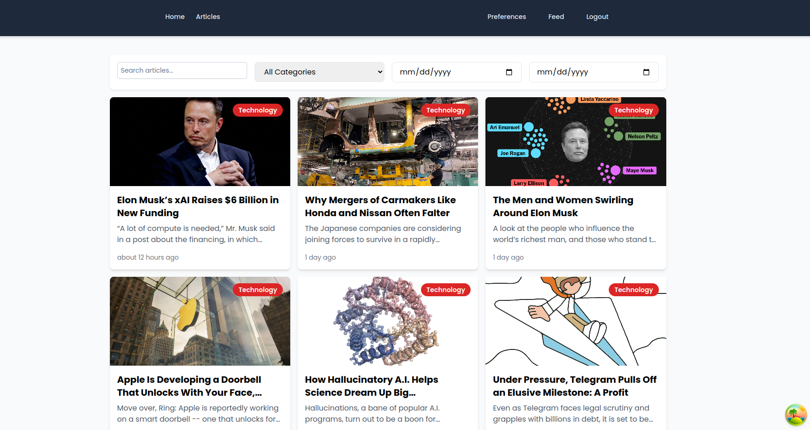
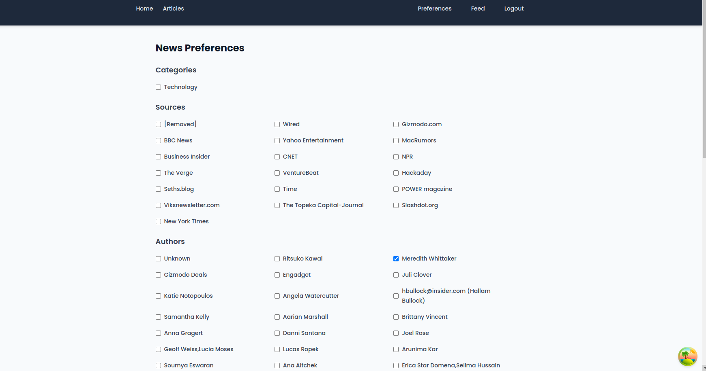
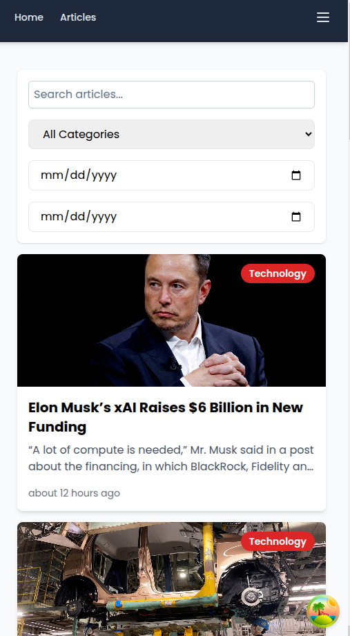

### Run the project

Git clone the project

cd to news-hub-backend

run cp .env.example .env

make sure you have this keys on your .env

NEWS_API_KEY

NEWYORK_API_KEY

GUARDIN_API_KEY

run docker run --rm \
 -u "$(id -u):$(id -g)" \
 -v "$(pwd):/var/www/html" \
 -w /var/www/html \
 laravelsail/php84-composer:latest \
 composer install --ignore-platform-reqs

then run ./vendor/bin/sail build

then run ./vendor/bin/sail up

then run ./vendor/bin/sail artisan migrate

then run ./vendor/bin/sail artisan scrape:news (this command fetches the data from three sources and stores it to the db)

### frontend

In an new terminal

cd news-hub-frontend

run docker-compose build

then run docker-compose up

then visit `http:localhost:5173`

